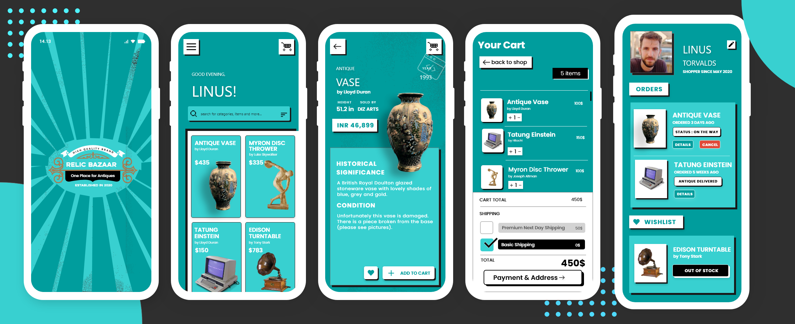

 

<h1 align= "left"><b>Motivation💭💭 </b></h1>

With the boons of internet🌐 spreading worlwide over the last two decades, e-commerce has evolved to be one of the largest industries💹!.

With the passage of time, platforms like Amazon, E-Bay, Flipkart, Myntra have become the modern supermarkerts for us.

From our fashioable clothes👗, shoes👟, grocery🥒, items of daily needs to mobile phones📱 we are accustomed to buy almost everything online. Even our food!🎂. Features like flexible options of payment, tons of choices to select from, assured delivery as well as great customer support have paved the way for the notion.

However, we found there's something that is left behind on the e-commerce wave.

__The Vintage Products__...Yes those items of immense cultural significance or historical importance. Maybe those coins from pre-independent India, that chair from the royal family or perhaps the autograph or soveniur your family members might have got from Mother Teresa. Trading with such items is a big hassle. Sometimes people are afraid to do so becasue of the notion that it is illegal. At times, they are fooled by middlemen who buy them in some hundreds of dollars and sell it in thousands. Additionaly, there are issues of authenticy as well delivery!

<h1 align= "left"><b>Our Solution🏗 </b></h1>

We propose an app with the vision to put back the traditional market of vintage on the tides of the ecommerce boom!. The UI is speficially made to provide a retro feel. We are using a blockchain based system for payments behind the scenes to enure privacy and encryption. The registration is simple and can be done using one's Google account as well. Using some beautiful yet consise forms we eliminate the paperwork for sellers. The recommendation engine tends to learn over time about one's taste and suggests similar items to buy. Computer vision based techiniques are used for quality assessment.

<h2 align= "left"><b>Here's some Sneak Peek🧐</b></h2>

&ensp;&ensp;&ensp;&ensp;&ensp;&ensp;&ensp;&ensp;

<h2 align= "left"><b>Our Mockup🎨</b></h2>

<h2 align= "left"><b>Tech Stack🧐</b></h2>

- Flutter
- Firebase
- Matic API
- TensorFlow + TensorFlow Lite

<h1 align= "left"><b>The Geeks behind this 🤓</b></h1>

&ensp;&ensp;&ensp;
&ensp;&ensp;&ensp;
&ensp;&ensp;&ensp;

<h4 align="center">
<a href="https://github.com/himanshusharma89">
<b>Himanshu Sharma</b></a>&ensp;&ensp;&ensp;&ensp;&ensp;&ensp;&ensp;
<a href="https://github.com/smaranjitghose">
<b>Smaranjit Ghose</b>&ensp;&ensp;&ensp;&ensp;&ensp;&ensp;&ensp;&ensp;&ensp;&ensp;&ensp;&ensp;&ensp;&ensp;
<a href="https://github.com/ishandeveloper">
<b>Ishan  Sharma</b>&ensp;&ensp;&ensp;&ensp;&ensp;&ensp;&ensp;&ensp;&ensp;&ensp;&ensp;&ensp;
<a href="https://github.com/anushbhatia">
<b>Anush Bhatia</b></h4>
 

